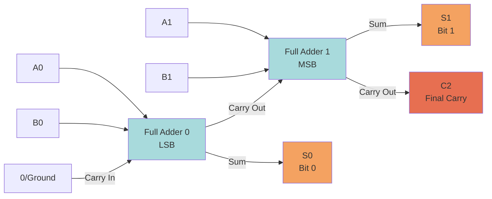

# MUX Full Adder Circuit

A 1-bit full adder built entirely from 2:1 MUX blocks.

## Inputs & Outputs

| Signal | Description |
|--------|-------------|
| **A** | First input bit |
| **B** | Second input bit |
| **Cin** | Carry in |
| **Sum** | Sum output (A ⊕ B ⊕ Cin) |
| **Cout** | Carry output |

## Components

| # | Component | Purpose |
|---|-----------|---------|
| 1 | MUX (XOR) | Computes A ⊕ B |
| 2 | MUX (Cout) | Computes carry out |
| 3 | MUX (Sum) | Computes sum bit |
| 4 | PowerSource 1 | Inverts B (for XOR) |
| 5 | PowerSource 2 | Inverts Cin (for Sum) |

## Circuit Design

### MUX 1: XOR Gate (A ⊕ B)

```
S = A
A-input = B
B-input = NOT(B)    ← wire B through PowerSource 1
Output = A ⊕ B
```

**How it works:**
- When A=0 → selects A-input → passes B
- When A=1 → selects B-input → passes NOT(B)
- Result: B when A=0, NOT(B) when A=1 = XOR

### MUX 2: Carry Out

```
S = A ⊕ B          ← output of MUX 1
A-input = Cin
B-input = A
Output = Cout
```

**How it works:**
- When A⊕B=0 (A and B same) → selects A-input → Cin (but A=B, so carry = A)
  - Wait, actually: when A⊕B=0, selects Cin. But if A=B=0, Cout should be 0 regardless of Cin... 
  - No: S=0 selects A-input = Cin. If A=B=0, Cin doesn't matter for carry (Cout=0). If A=B=1, Cout=1.
  - Actually S=0 → A-input = Cin. When A=B=1, we need Cout=1. Cin is independent...
  
  Let me re-derive:
  
  **Correct Cout:** Cout = A·B + Cin·(A⊕B)
  
  As a MUX with S = A⊕B:
  - S=0 (A=B): Cout = A·B = A (since A=B). Select **B-input = A** ✓
  - S=1 (A≠B): Cout = Cin. Select **A-input = Cin** ✓

```
S = A ⊕ B          ← output of MUX 1  
A-input = Cin       ← selected when S=1 (A≠B)
B-input = A         ← selected when S=0 (A=B)
Output = Cout
```

### MUX 3: Sum

```
S = A ⊕ B          ← output of MUX 1
A-input = Cin       ← selected when S=1 (A≠B)  
B-input = NOT(Cin)  ← wire Cin through PowerSource 2, selected when S=0 (A=B)
Output = Sum
```

**How it works:**
- When A⊕B=0 (A=B) → selects B-input → NOT(Cin). Sum = NOT(Cin) when A=B ✓
  - A=B=0, Cin=0 → Sum=1? No that's wrong. 0+0+0=0.
  
  Let me re-derive:
  
  **Correct Sum:** Sum = A ⊕ B ⊕ Cin
  
  As a MUX with S = A⊕B:
  - S=0 (A=B): Sum = 0 ⊕ Cin = Cin. Select **A-input = Cin**
  - S=1 (A≠B): Sum = 1 ⊕ Cin = NOT(Cin). Select **B-input = NOT(Cin)**

```
S = A ⊕ B          ← output of MUX 1
A-input = Cin       ← selected when S=0 (A=B)
B-input = NOT(Cin)  ← wire Cin through PowerSource 2, selected when S=1 (A≠B)
Output = Sum
```

## Summary Wiring Table

| MUX | S (select) | A-input (S=0) | B-input (S=1) | Output |
|-----|-----------|----------------|----------------|--------|
| XOR | A | B | NOT(B) via PS1 | A⊕B |
| Cout | A⊕B | A | Cin | Cout |
| Sum | A⊕B | Cin | NOT(Cin) via PS2 | Sum |

## Truth Table Verification

| A | B | Cin | A⊕B | Cout | Sum |
|---|---|-----|------|------|-----|
| 0 | 0 | 0 | 0 | 0 | 0 |
| 0 | 0 | 1 | 0 | 0 | 1 |
| 0 | 1 | 0 | 1 | 0 | 1 |
| 0 | 1 | 1 | 1 | 1 | 0 |
| 1 | 0 | 0 | 1 | 0 | 1 |
| 1 | 0 | 1 | 1 | 1 | 0 |
| 1 | 1 | 0 | 0 | 1 | 0 |
| 1 | 1 | 1 | 0 | 1 | 1 |

## 2-Bit Ripple Carry Adder

Chain two full adders to add 2-bit numbers (e.g., 3 + 3 = 6):



**Connection Summary:**
- **FA0 (LSB):** A0 + B0 + 0 → S0, C1
- **FA1 (MSB):** A1 + B1 + C1 → S1, C2

**Total: 6 MUXes + 4 PowerSources + 3 output lamps**

- FA0 Cin: wire to nothing (HIGH_Z = 0) or ground
- FA1 Cin: wire to FA0's Cout
- Outputs: S0, S1, Cout → 3 lamps showing the 3-bit result

### Example: 3 + 3

- A1=1, A0=1, B1=1, B0=1
- FA0: 1+1+0 → S0=0, C0=1
- FA1: 1+1+1 → S1=1, Cout=1
- Result: **110** (binary) = **6** ✓

## MUX Reminder

```
┌─────────┐
│  MUX    │
│         │
│ S=0 → A │──→ Output
│ S=1 → B │
│         │
└─────────┘
```

- 2-block multiblock, paired on one axis
- S InputPort on narrow face (opposite pair seam)
- A InputPort on one block's fat face
- B InputPort on other block's fat face
- Output = all fat faces without InputPorts
